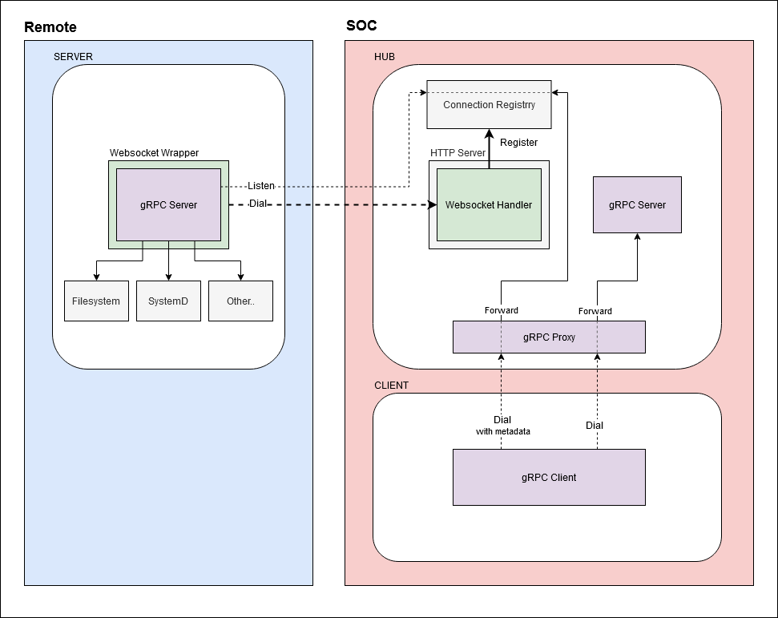

# gRPC Demo

## Components
### Hub
The Hub acts as a gRPC proxy for remote gRPC servers behind NAT/Firewalls.

The hub also hosts a local gRPC server to make hub specific requests (Ex.: getting the list of currently registered clients).

Clients that want to expose their gRPC server bindings will register themselves by dialing a websocket handler exposed by the Hub and providing authentication data through Hub specific HTTP headers. The handler takes care of wrapping the connection as a raw transport and registers it with the Hub client registry.

To send a gRPC request to a registered client, a gRPC client must provide gRPC metadata containing the "name" key set to the desired client name.

### Server
The Server hosts a plain gRPC server that exposes its services by registering itself to the Hub upon starting.

### Client
The Client is a CLI that can send gRPC requests to both the remote Servers services connected to the Hub and the Hub gRPC services.

## Flowchart


## Development
Generate self signed cert/key pair
```
$ make gencert
# confirm with:
$ make readcert
```

Regenerate protocol buffers
```
$ make pb
```

Generate self signed certificate, compile proto files and build binaries
```
$ make
```

Run hub
```
$ cd ./bin
$ ./hub serve --tls --tls-cert-file test.crt --tls-key-file test.key
```

In a different shell, connect server to hub, using the name: testserver as identifier
```
$ cd ./bin
$ ./server serve testserver --hub-uri wss://localhost:8080/ws --tls-insecure-skip-verify
```

In a different shell, get the list of registered clients.</br>
Then, send a gRPC request to a remote server through the Hub
```
$ cd ./bin
$ echo '{}' | ./client hub list-clients
$ echo '{}' | ./client fluentd start testserver
```

## Ideas
- Create internal.Activity service with Connect method.
  - The Connect method returns a stream of ActivityEvent
  - The message can contain an EventType field with possible values:
    - Client Registered
    - Client Unregistered
    - Request Proxied
