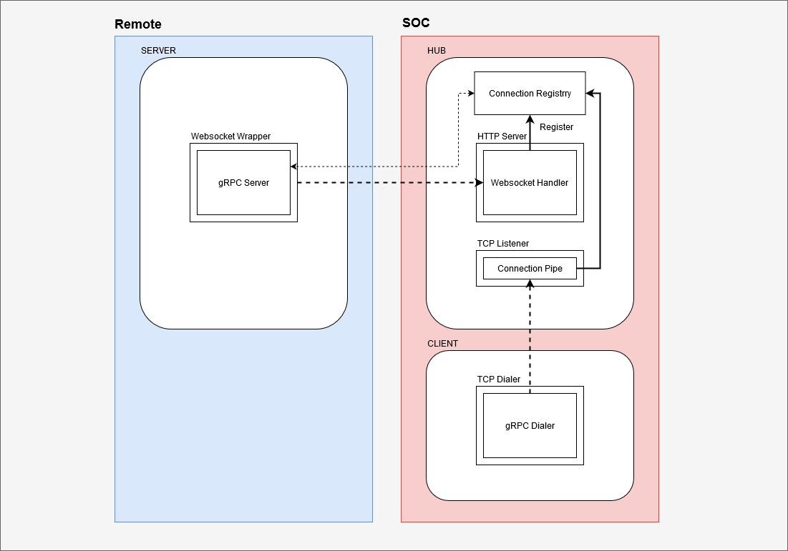

# gRPC Demo

## Context
- We own SOCs that hosts our application environment.
- We own servers residing in client remote private networks that are behind corporate firewalls.
  - We cannot reach remote servers first because of NAT/Firewalls. The server needs to initiate the connection first.
- We need to communicate with these remote servers from the SOCs.

## Current concept
- The remote server creates a gRPC server.
- The remote server then initiates a Websocket connection to a "Hub" server.
- The remote server does:
  - It wraps the Websocket connection to convert it to a raw socket.
  - It serves the gRPC server using the wrapped connection as listener.
- The Hub does:
  - Authentication/authorization, etc.
  - Wraps the websocket connection to convert it to a raw socket.
  - Assigns the connection a unique ID and registers it internally.
- The Hub is now free to use the registered connection as a dialer when maing gRPC requests.

## Current implementation


### Server Flow
- Dial the hub on its websocket listening uri (wss://hub:8080/ws).
- Upon successful websocket upgrade, it creates a gRPC server, wraps the websocket connection into a raw socket and listens on it.

### Hub Flow
Remote Server side
- Listen on wss://hub:8080/ws for incoming websocket connections.
- Upon successful websocket upgrade, it wraps the connection and registers it using a unique ID.

Local client side
- Listen on port 9090 for raw TCP connections.
  - The client can dial this raw socket and use the connection returned as a dialer for its gRPC call. This is the current implementation.
- Upon successful TCP accept, it connects both ends to a registered connection.
  - Currently, for demonstration purposes, the first registered connection is hardcoded as the one served.
  - My idea would be to do a custom handshake on TCP using a JSON payload between the client and hub.
    - This handshake would let the client send authentication details, and also asks for a particular server to talk to.

### Client Flow
- Provides a CLI to make gRPC requests to a gRPC server.
- Can provide a request payload using STDIN or a file.
- Codecs available: json/xml/yaml.


## Development
Generate protocol buffers

Generate cert/key in cwd for hub (test.crt/test.key)
```
$ make gencert
$ make readcert
reading generated cert..
openssl x509 -text -noout -in test.crt
Certificate:
...
```

Regenerate protocol buffers
```
$ make pb
```

Build all
```
$ make
```

Run hub
```
$ go run ./cmd/hub serve --tls --tls-cert-file test.crt --tls-key-file test.key
```

Connect server to hub
```
$ go run ./cmd/server serve --tls-insecure-skip-verify --hub-uri wss://localhost:8080/ws
```

Call grpc service on the server through hub using raw tcp forward
```
$ echo '{}' | go run ./cmd/client fluentd start -s localhost:9090
```
